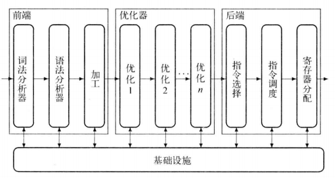

# CH01 编译概观 (Overview of Compilation)

- [1.1 简介](#11-简介)
- [1.2 编译器结构](#12-编译器结构)
- [1.3 转换概述](#13-转换概述)
  - [1.3.1 前端](#131-前端)
  - [1.3.2 优化器](#132-优化器)
  - [1.3.3 后端](#133-后端)
- [1.4 小结与展望](#14-小结与展望)

## 1.1 简介

### 概述

编译器：用于**转换**其他计算机程序的计算机程序。

典型结构：源语言 > 中间表示 > 优化器 > 目标语言。

编译器将以某种语言编写的程序作为输入，产生一个等价的程序作为输出。

- 输入：源语言，程序设计语言，如：C, C++, Java, ..
- 输出：目标语言，某处理器的指令集，如：x86, MIPS, RISC-V, ..

也有目标为程序设计语言的编译器，通常称为源到源的转换器。

许多其他系统也可视为编译器，如产生 PostScript 的排版程序。而将 PostScript 转换为像素的代码通常是一个解释器，而不是编译器。

解释器：将一种可**执行**规格作为输入，产生的输出是执行该规格的结果。

- 一些语言，如 Perl, Python 等，更多是用解释器实现，而不是编译器。
- 一些语言采用的转换方案，既包括编译，也包括解释。如 Java 从源代码编译为一种称为字节码的形式，而 Java 应用程序是通过在对应的 Java 虚拟机（JVM）上运行字节码来执行的，JVM 是一种字节码的解释器。

解释器和编译器有许多共同之处，它们执行许多相同的任务：

- 都要分析输入程序，并判定它是否是有效的程序
- 都会建立一个内部模型，表示输入程序的结构和语义
- 都要确定执行期间在何处存储值

然而，解释代码来产生结果，与编译输出目标程序来产生结果，二者有很大不同。

### 为何研究编译器的构建

一个好的编译器是自成天地的，包含了整个计算机科学的一个映像。编译器实际运用了贪心算法（寄存器分配）、启发式搜索（表调度）、图算法（四代码消除）、动态规划（指令选择）、有限自动机和下推自动机（词法分析和语法分析）以及不动点算法（数据流分析）。它处理诸如动态分配、同步、命名、局部性、分级存储结构管理和流水线调度等问题。很少有软件系统能汇集同样多且复杂的组件。处理编译器的内部设计和实现在软件工程方面所获取的难得的实践经验，是那些规模较小、复杂度较低的系统所无法提供的。

- 学习编译器构建是计算机科学教育的一个重要部分。
- 编译器的成功是将理论应用到实际问题的范例。
  - 自动产生词法分析器和语法分析器的工具应用了形式语言理论的结果。这些工具同样可用于文本搜索、网站过滤、文字处理和命令行语言解释器。
  - 类型检查和静态分析应用了格理论、数论和其他数学分支的结果，以理解并改进程序。
  - 代码生成器使用了树模式匹配、语法分析、动态规划和文本匹配的算法，来自动化指令选择的过程。
- 但编译器构建领域出现的一些问题仍然未解决，即当前的最佳解决方案仍有改进的余地。
- 构建成功的编译器需要精通算法、工程和计划。

### 编译的基本原则

- **正确性**：编译器必须保持被编译程序的语义。
- **实用性**：编译器必须以某种可觉察的方式改进输入程序。

## 1.2 编译器结构

> 源程序 > [ 前端 > IR > 后端 ] > 目标程序

- 前端：专注于理解源语言程序。
- 后端：专注于将程序映射到目标机。
- IR：编译器对所转换代码的中间表示（Intermediate Representation）。
  - 实际上，随着编译过程的进展，可以使用几种不同的 IR。但在每个点上，都只有一种表示。

前后端分离可以简化编译器重定目标的过程。即单个前端构建多个后端，针对不同处理器生成代码。类似地，可以多个前端生成同样的 IR 并使用共同的后端。

编译器可以在代码的 IR 形式上进行多遍迭代，以生成更好的代码。

- 前一阶段：研究代码并记录相关细节进 IR
- 后续阶段：利用这些知识记录来提高转换的质量

引入 IR 还可以向编译器增加更多阶段，例如优化器：

> 源程序 > [ 前端 > IR > 优化器 > IR > 后端 ] > 目标程序

优化器：以 IR 作为其输入，产生一个语义上等价的 IR 作为其输出。

- 优化器是一个 IR 到 IR 的转换器，试图在某些方面改进 IR。
- 优化器可以对 IR 处理一遍或多遍，分析 IR 并重写 IR。可能目标：
  - 使后端生成一个可能更快速或更小的目标程序。
  - 产生更少缺页异常或耗能较少的程序。

概念上，三阶段结构表示了经典的优化编译器。

典型编译器的结构：



## 1.3 转换概述

```
a ← a × 2 × b × c × d
```

### 1.3.1 前端

#### 检查语法

检查语法，来判断输入代码是否属于语法定义的有效程序集合。

- 词法分析器（Scanner）：将字符构成的串转换为单词构成的流。
- 语法分析器（Parser）：判断输入流是否是源语言的一个句子。
- 类型检查（Type checking）：检查输入程序中对名字的使用在类型方面是否一致。

#### 中间表示

编译器前端处理最后是生成代码的 IR 形式。

对于源语言中的每一种结构，编译器都需要一种策略，指定如何用代码的 IR 形式实现该结构。具体的选择可能会影响到编译器转换和改进代码的能力。

### 1.3.2 优化器

优化器分析代码的 IR 形式，以发现有关上下文的事实，并利用此项上下文相关知识来重写代码，使之能够以更有效的方式来算得同样的答案。

- 分析：判断编译器可以在何处安全地应用优化技术且有利可图。
  - 数据流分析：编译时一种对运行时数据值流动得判断。通常需要解一个联立方程组，该方程组是根据被转换代码的结构得出的。
  - 相关性分析：使用数论中的测试方法来推断下标表达式的可能值。它用于消除引用数组元素时的歧义。
- 转换：使用分析的结果来将代码重写为一种高效的形式。
  - 此前已经发明了无数的转换技术，用于改进可执行代码的时间或空间需求。

### 1.3.3 后端

编译器的后端会遍历代码的 IR 形式并针对目标机输出代码。

#### 指令选择

代码生成的第一阶段会将 IR 操作重写为目标机操作，这个过程称为指令选择。

指令选择将每个 IR 操作在各自的上下文中映射为一个或多个目标机操作。

#### 寄存器分配

在指令选择期间，编译器有意忽略了目标机寄存器数目有限的事实。它反而假定有“足够”的寄存器存在，并使用所谓的虚拟寄存器。实际上，编译的前期对寄存器的要求可能高于硬件的能力。寄存器分配器必须将这些虚拟寄存器映射到实际的目标机寄存器。

#### 指令调度

为产生执行快速的代码，代码生成器可能需要重排操作，以照顾目标机在特定方面的性能约束。

不同操作的执行时间可能是不同的。

许多处理器都有一种特性，可以在长延迟操作执行期间发起新的操作。只要新操作完成之前不引用长延迟操作的结果，执行都可以正常地进行。

#### 代码生成的各组件间的交互

编译中大多数真正困难的问题出现在代码生成期间。而这些问题相互影响，使得情况更为复杂。

> 与编译器前端相比，优化器和代码生成中算法的选择对编译时间有更大的影响。

## 1.4 小结与展望

编译器构建是一项复杂任务。好的编译器合并了来自形式语言理论、算法研究、人工智能、系统设计、计算机体系结构和程序设计语言理论的思想，并将其应用到程序转换的问题上。编译器汇集了贪心算法、启发式技术、图算法、动态规划、DFA 和 NFA、不动点算法、同步和局部性、分配和命名，以及流水线管理。编译器面临的许多问题很难给出最优解，因此它使用近似算法、启发式技术和经验规则。这样做产生的复杂交互可能导致令人惊奇的结果，好坏兼有。

为将这些活动置于一个有条理的框架中，大多数编译器组织成三个主要的阶段：前端、优化器和后端。每个阶段都有一组不同的问题要解决，用于解决这些问题的方法也各不相同。前端专注于将源代码转换为某种 IR。前端依赖于形式语言理论和类型理论的结果，以及若干健壮的算法和数据结构。中间部分或优化器，会将一个 IR 程序转换为另一个，其目标是生成执行更高效的 IR 程序。优化器分析程序得出关于其运行时行为的知识，而后利用此项知识来变换代码并改进其行为。后端将 IR 程序映射到特定处理器的指令集。对寄存器分配和指令调度方面的困难问题，后端会近似求解，其近似解的质量对于编译后代码的速度和大小有着直接影响。
